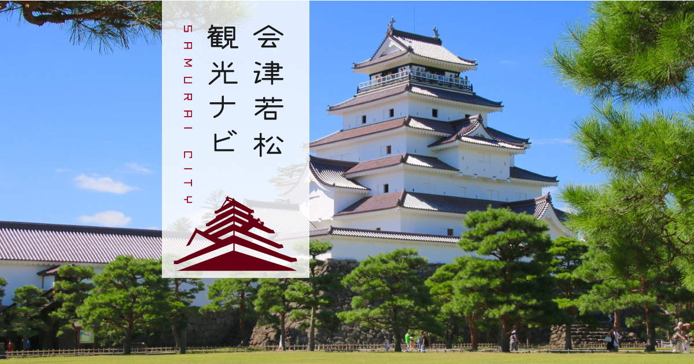

# Aizu Survival Guide
## Helping Foreigners Adapt to Life in Aizu

Welcome to the Aizu Survival Guide repository! This repository is dedicated to making life in Aizu easier for foreigners. We aim to provide valuable information and resources to help you navigate your experience in Aizu.

## Available Languages
Currently available language versions:
- [简体中文](/README_CN.md)
- [繁体中文](/README_TW.md)
- [English](/README.md)
- *Welcome to contribute more languages!*

## Current Sections
- Transportation
  - Aizu ↔ Tokyo
    - [Overview of Transportation](/docs/EN/Traffic_Tokyo_Overview_EN.md)
    - [Taking the Bus](/docs/EN/Traffic_Tokyo_Bus_EN.md)
    - [Using the Shinkansen](/docs/EN/Traffic_Tokyo_Shinkansen_EN.md)

## Contribution Guidelines
We welcome your contributions! If you have valuable experiences, insights, or suggestions to share, feel free to contribute. Check our [Contribution Guidelines](CONTRIBUTING.md) for details on how to get involved.

## Acknowledgments
We would like to thank all contributors and supporters of this project. Your input helps us improve and expand this guide.

We look forward to helping you thrive in Aizu!

