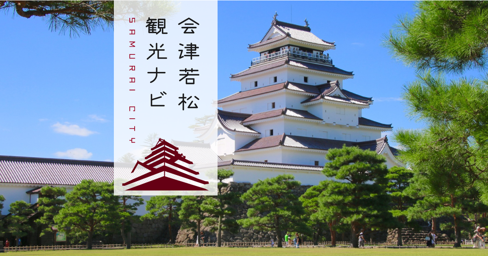

# 會津生活指南
## 幫助外國人適應在會津的生活

歡迎來到會津生活指南的存儲庫！該存儲庫致力於幫助外國人更好地適應在會津的生活。我們旨在提供有價值的信息和資源，以幫助您順利度過在會津的生活體驗。

## 可用語言版本
目前可用的語言版本：
- [簡體中文](/README_CN.md)
- [繁體中文](/README_TW.md)
- [English](/README.md)
- *歡迎貢獻更多語言版本！*

## 當前章節
- 交通
  - 會津 ↔ 東京
    - [交通概覽](/docs/TW/Traffic_Tokyo_Overview_TW.md)
    - [搭乘巴士](/docs/TW/Traffic_Tokyo_Bus_TW.md)
    - [使用新干線](/docs/TW/Traffic_Tokyo_Shinkansen_TW.md)

## 貢獻指南
我們歡迎您的貢獻！如果您有寶貴的經驗、見解或建議要分享，請隨時參與貢獻。查看我們的[貢獻指南](CONTRIBUTING.md)以獲取有關如何參與的詳細信息。

## 致謝
我們要感謝所有支持本項目的貢獻者和支持者。您的意見幫助我們不斷改進和擴展這個指南。

期待能幫助您在會津過上幸福的生活！

