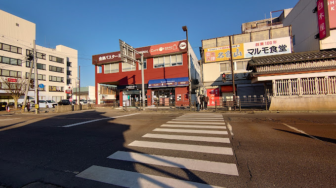

# 会津指南 

## 交通篇

### Tokyo

#### Aizu → Tokyo

##### Bus
**Fare**
Bus is the cheapest way to get to Tokyo, but it will take about 4-5 hours.
Currently (2023-06-07), Aizu-Tokyo Bus fares are based on calendar floating prices.
[Screenshot]
Regular Bus tickets are categorized into S, A, and B. Typically, consecutive holidays including holidays are S, regular weekends are A, and weekdays are B.
Early Bird Bus tickets are also categorized into S, A, and B, but they are less expensive, with discounts reaching about 60%.
Tips about Early Bird Tickets:
1. The number of Early Bird Tickets is limited, and they are usually opened for sale one month in advance (sometimes it will be 31 days in advance, and sometimes 29 days in advance). Please check the ticketing website around one month in advance to see if they are available for purchase. The refresh time for tickets is 10:00 a.m. every day. 2.
2. Early Bird tickets are generally available on weekdays, but early bird tickets for weekends are limited and usually sell out within a day (or even within a few hours). For early bird tickets on holidays, they are usually sold out within minutes.

Exact ticket prices will be posted on the official website, so check it out.
You can also click on the link below to see the latest ticket prices:
https://www.aizubus.com/highway/shinjuku/

**Ticketing**
Ticketing website in Japanese: https://www.kousokubus.net/BusRsv/ja/
Ticketing website in English - Korean - Simplified Chinese - Traditional Chinese: https://www.kousokubus.net/JpnBus/en
The ticketing website has detailed procedures for purchasing tickets, so I won't repeat them here.
The Tokyo Line is the only one of Aizu's common highway bus routes that requires advance ticketing, and is operated on a "reservation system". If you forget to buy a ticket or buy a ticket on the wrong day, you can talk to the conductor, and there are usually seats available on the bus, so you can buy a ticket and get on the bus.
Tickets can also be purchased at the Aizu Bus Terminal and Shinjuku Bus Terminal ticket counters.

**Stations**
When traveling in Aizuwakamatsu City, there are two boarding points, Aizuwakamatsu Ekimae Bus Terminal and Aizuwakamatsu Apio.
Please note that unlike other highway bus routes, the "Kitayanagahara" and "Tsurugajo-mae (contracted company)" stops are not included in the boarding and alighting area of the Tokyo Line.
* Aizu Station Bus Terminal
Please note that the Aizu Ekimae Bus Terminal is not the same place as the Aizu-Wakamatsu Ekimae (Aizu-Wakamatsu JR Station) stop.
Below is a screenshot and a link to Google Map:
https://goo.gl/maps/qgiU622bZdTWoRsj8

Bicycles can be parked here:
https://www.google.com/maps/@37.5077452,139.9316315,19z?entry=ttu
* Aizu Wakamatsu Apio
The boarding point for Apio is here:
https://www.google.com/maps/@37.5203862,139.9182684,95m/data=!3m1!1e3?entry=ttu
Apio is suitable for residents who own private cars in addition to those who live in its neighborhood.Apio has a free parking lot with two parking lots. However, please note that you have to buy two round trip Bus tickets to use this parking lot or you will be fined if you are caught. Also, it is a reservation system and you need to call the phone to make a reservation. Usually, you will be asked to tell them your [name, phone number, round-trip bus time, and license plate number] on the phone.
Here is the phone number:
Mon-Fri 0242-22-5560 (except for the year-end and year-end 9:00～18:00)
Saturdays, Sundays, and holidays 0242- 22-5583 (9:00～16:00)
Here are the locations of the parking lots:
First parking lot
https://www.google.com/maps/@37.5191734,139.9184482,95m/data=!3m1!1e3?entry=ttu
Second parking lot
https://www.google.com/maps/@37.5190794,139.9189643,138m/data=!3m1!1e3?entry=ttu

**Ride**
* Waiting for the Bus
Please arrive at the Bus stop early and wait for the Bus to arrive. However, you usually don't have to worry about the Bus leaving early (but it may step off, so please be sure to arrive early). Due to traffic, the bus to Aizuwakamatsu Apio is 5-10 minutes late in most cases. However, the bus to Aizuwakamatsu Station Bus Terminal is usually not late. Please be patient.

* Luggage
Suitcases and large luggage can be placed in the storage area under the special vehicle. The driver will help you to open the door of the storage area before boarding the bus, and sometimes you need to place them by yourself, sometimes the driver will help you.
Usually 2 large suitcases can be put down during busy non-holiday periods.
Normal backpacks and carry-on bags can be brought on board.

* Getting on the bus
When you finish purchasing your ticket, you will receive an email, either a PDF file for printing or a web page, and need to ask the driver/machine to scan the QR code, so please prepare it in advance. In some cases, you may only need to show the PDF file or Web page.
When you get on the bus, please sit down according to the seat number you chose when you purchased the ticket. And fasten your seat belt.

* While traveling
Please be aware that you need to be quiet while traveling on buses in Japan, so please do not disturb other people.
Most buses provide free WiFi and charging ports. (However, because of the different models, some things require plugs and some are USB ports)

* SA/PA Service Area
There are two SA/PA stops on the Tokyo Line, [Abukuma PA] and [Hasei SA].
However, the typical stop is only 8-15 minutes (depending on traffic), and it's usually time to use the restroom and purchase food. It is almost unlikely that you will be able to eat in the service area.
Please don't miss the Bus.
PS: Abukuma PA is currently (07/28/2023) closed for all stores, only toilets and vending machines.

* Getting off the train
There are three drop-off points on the Tokyo Line: [Oji Station], [Ikebukuro Station] and [Shinjuku].
The fare is the same no matter where you get off, so please don't worry.
When you get close to the drop-off point, the car will announce a voice, when the voice is almost finished, press the button to tell the driver that someone wants to get off, then the driver will stop the car. Because the Tokyo line is quite busy, the button is pressed in most cases. The button only needs to be pressed by someone, so there is no need to press it repeatedly. Please don't press the button too early either, it will make the driver think there is an emergency.
When the bus stops, then unbuckle your seatbelt, take your luggage, and get off the bus. The aisles are narrow, so please be courteous.
If you are carrying a paper ticket, then please give it to the driver before getting off the bus.
**Oji Station**
This is a stop in northern Tokyo. If you are planning to go to [Akabane], [Saitama], etc., you can choose to get off here.
If you wish to get to Shinjuku or other places quickly, you can get off at Oji Station and take the JR line to get there, as the BUS takes the surface road and will travel slower and longer due to traffic lights and traffic jams. If you are a passenger who suffers from severe motion sickness, please consider getting off at Oji Station and taking another means of transportation to your destination.
Also, if you are traveling to Haneda Airport, it is faster to get off at Oji Station and take a train to Haneda Airport.
Please refer to the article [Getting to Haneda Airport].
**Ikebukuro Station***
Please note that Ikebukuro Station only has a drop-off point, not a boarding point.
**Shinjuku Station**
[TBD]

##### 新干线
**票价**
新干线票价较高昂，但灵活性、舒适性和速度都是最优的。
因为会津并没有新干线停靠点，所以需要乘坐Bus/火车前往新干线站点。
最近的新干线站点是郡山Koriyama站。
【如何到达Koriyama，请参考】

新干线也存在早鸟票，折扣力度一般是7折～95折。请使用Ekinet购票方式

**购票**
1. 通过Ekinet网上购票（仅支持JR东日本的新干线、特快列车）。
网址是：https://www.eki-net.com/personal/top/index.html
Ekinet也支持绑定西瓜卡Suica，可以直接通过Suica乘坐新干线。

2. 线下购票。
虽然会津若松站没有新干线，但在购票机器上仍然可以买到新干线的票。若有疑问，也可以在售票窗口询问。

PS：会津大学的学生享有学生折扣，详情请咨询会津大学SAD。

**乘车**
新干线乘坐指南：
https://global.jr-central.co.jp/zh-CN/tickets/use/

##### 火车（在来线）
此种方法比较硬核，不适合新手。因此我们这里仅简略带过，推荐拥有青春18的学生群体在休闲时刻体验。
会津若松-会津田岛-浅草
会津若松-郡山-（东北本线）-宇都宫-东京

#### 东京　→　会津
##### BUS
**票价**
巴士是从会津前往东京最便宜的方式，但会历时4-5小时左右。
目前（2023-06-07），会津-东京的Bus票价采用日历浮动价格。
普通Bus票分为S、A、B三个等级，通常来说，含节假日的连休为S、普通周末为A、工作日为B。
早鸟Bus票同样也分为S、A、B三个等级，但是价格更低，折扣达到6折左右。
关于早鸟票的Tips：
1. 早鸟票的数量有限，一般会在一个月前开放售票（有时会是31天前、也有时是29天前）。请在一个月前左右查看购票网站，查询是否可以购买。购票刷新时间是每天10:00。
2. 工作日的早鸟票一般情况比较多，但是周末的早鸟票数量有限，一般会在一天内（甚至几小时内）售罄。对于节假日的早鸟票，一般会在几分钟内售罄。

具体票价在官网上会公布，请查阅。
也可以点击下面的链接查看最新的票价：
https://www.aizubus.com/highway/shinjuku/

**购票**
日文购票网站：https://www.kousokubus.net/BusRsv/ja/
英文·韩文·简体中文·繁体中文的购票网站：https://www.kousokubus.net/JpnBus/en
购票网站上有详细的购票流程，这里不再赘述。
东京线是会津常见的高速巴士路线中唯一一条需要提前购票的路线，采取“预约制”。若忘记购票或买错日期，可以与乘务员沟通，一般车内会有空位，可以购买车票上车。
也可以到会津BusTerminal和新宿BusTerminal的售票窗口购票。

**车站**
在东京乘坐Bus的上车点两个，分别是新宿BusTermianl和王子站。
请注意，池袋站不在乘车点上！
* 新宿BusTermianl
会津的乘车区域为A区域，但有可能会变动。请在乘车前查看并确认Bus的乘车区域。

* 王子站
王子站的乘车点并不在JR站的公交区域内，而是需要步行3分钟左右。
https://goo.gl/maps/4szJ7wUKEggccbR27
请注意，这个高速巴士乘车点有很多路线，请不要上错车。
同时，因为东京的交通拥堵，所以通常王子站的到达时间会延误15分钟。如果是高峰时间段，甚至会达到30分钟。也有少数情况，Bus会提前到达。
不过乘车仍需要提前抵达，但也不用因为Bus迟迟未来而焦急。

**乘车**
* 候车
请提前到达Bus站点，等待Bus的到来。但一般不用担心Bus提前开走（但可能会踩点离开，所以请务必提早到达）。

* 行李
行李箱和大件行李，可以放在专用的储物区，在上车前会有司机帮忙打开储物区的门，有时需要自己摆放，有时司机会帮忙。
一般非节假日的繁忙期间，2个大型旅行箱是可以放下的。如果担心，可以在新宿站乘车。
一般的背包、随身包可以带上车。

* 上车
当你完成购票后，你会收到邮件，无论是打印用的PDF文件或者是Web网页，需要让司机/机器扫描QR码，请提前准备好。
上车后，请按照购票时选择的座位号坐下。并系好安全带。

* 行车中
请注意，在日本的Bus行驶中，需要保持安静，请勿影响到其他人。
大部分Bus都会提供免费的WiFi和充电口。（但因为车型各异，有些事需要插头、有些是USB口）

* SA/PA 服务区
东京线会停靠两个SA/PA，分别是【羽生SA】和【阿武隈PA】。
不过一般停留时间仅有8-15分钟（取决于交通情况），一般上个厕所、购买食物就到时间了。几乎不太可能能在服务区吃饭。
请不要错过Bus。
PS: 阿武隈PA目前（2023年07月28日）关闭了所有的商店，只有厕所和自动售货机。

* 下车
东京线（开往会津）在会津若松市内的下车点有两个，分别是【会津Apio】和【会津若松JR站前】
无论在哪里下车，票价都是一样的，请不用担心。（仅限于会津若松市内）
当快靠近下车点时，车内会播报语音，当语音快结束后，按下按钮就可以告诉司机有人要下车，那么司机就会停车。因为东京线比较繁忙，所以大多数情况都有人按钮。按钮只要有人按了就可以了，不用重复按。也请不要太早按钮，会让司机认为有急事。
当Bus停稳后，再解开安全带，拿好行李，下车。过道较窄，请注意礼让。
如果你携带了纸质车票，那么请在下车前，将车票交给司机。
**会津Apio**
【待定】

**会津若松站前（JR火车站前）**
【待定】

**出租车/公交优惠**
优惠：
https://www.aizubus.com/highway/shinjuku/shinjuku_line_transfer

##### 新干线
**票价**
新干线票价较高昂，但灵活性、舒适性和速度都是最优的。
因为会津并没有新干线停靠点，所以需要在郡山乘坐Bus/火车前往会津若松。
最近的新干线站点是郡山Koriyama站。
【如何从Koriyama抵达会津，请参考】

新干线也存在早鸟票，折扣力度一般是7折～95折。请参考Ekinet购票方式
【】

**购票**

**乘车**

##### 火车（在来线）
此种方法比较硬核，不适合新手。因此我们这里仅简略带过，推荐拥有青春18的学生群体在休闲时刻体验。
会津若松-会津田岛-浅草
会津若松-郡山-（东北本线）-宇都宫-东京

请抵达新宿站后，前往新宿Bus terminal。 
你可以查看最新的时刻表： 
https://www.aizubus.com/highway/shinjuku/shinjuku_line_down
关于会津-东京便宜Bus票的购买方法，请参考： 
【】 

#### 

 