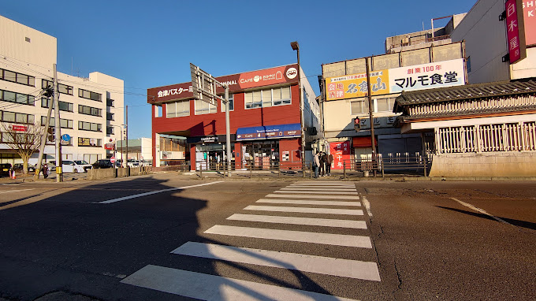
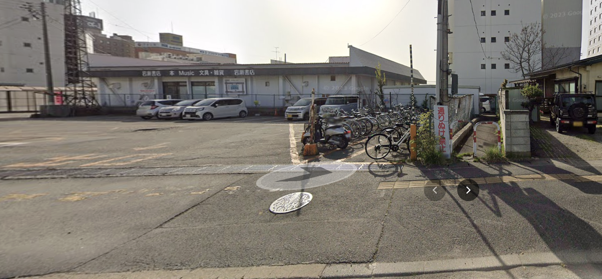

# 会津指南 
## 交通篇
### 东京 高速巴士
#### 票价
巴士是前往东京最便宜的方式，但会历时4-5小时左右。
目前（2024-01-10），会津-东京的Bus票价采用日历浮动价格。

普通Bus票分为S、A、B三个等级，通常来说，含节假日的连休为S、普通周末为A、工作日为B。
早鸟Bus票同样也分为S、A、B三个等级，但是价格更低，折扣达到6折左右。
关于早鸟票的Tips：
1. 早鸟票的数量有限，一般会在一个月前开放售票。请在一个月前左右查看购票网站，查询是否可以购买。购票刷新时间是每天10:00。
例如：你希望购买2月10日的票，那么应该在1月09日10:00查看购票网站，查询是否可以购买。
特殊日期的购买时间（更新于2024-01-10）

| 乘车日 | 发售开始日 |
| --- | --- |
| 1月1日        | 12月1日           |
| 2月1日        | 12月31日          |
| 3月1日        | 1月28日   (闰年 1月29日) |
| 3月30日       | 3月1日  (闰年 2月29日)  |
| 3月31日       | 3月1日            |
| 4月1日   4月2日 | 3月1日            |
| 5月1日        | 3月30日           |
| 6月1日        | 5月1日            |
| 7月1日        | 5月30日           |
| 8月1日        | 7月1日            |
| 9月1日        | 7月31日           |
| 10月1日       | 8月30日           |
| 11月1日       | 10月1日           |
| 12月1日       | 10月30日          |

2. 工作日的早鸟票比较多，但是周末的早鸟票数量有限，一般会在一天内（甚至几小时内）售罄。对于节假日的早鸟票，一般会在几分钟内售罄。

3. 特殊时间段（如年末年初、春节、Golden Week、夏季休暇、银周休暇等）可能会增加额外班次。

具体票价在官网上会公布，请查阅。
也可以点击下面的链接查看最新的票价：
https://www.aizubus.com/highway/shinjuku/

#### 购票
日文购票网站：https://www.kousokubus.net/BusRsv/ja/
英文·韩文·简体中文·繁体中文的购票网站：https://www.kousokubus.net/JpnBus/zhcn
购票网站上有详细的购票流程，这里不再赘述。
东京线是会津常见的高速巴士路线中唯一一条需要提前购票的路线，采取“预约制”。若忘记购票或买错日期，可以与乘务员沟通，一般车内会有空位，可以购买车票上车。
也可以到会津BusTerminal和新宿BusTerminal的售票窗口购票。

#### 会津　→　东京·新宿
##### 车站
在会津若松市乘车，有两个上车点，分别是会津若松站前Bus terminal和会津若松Apio。
请特别注意，东京线与其他高速巴士路线不同，“北柳原”“鶴ヶ城・合同庁舎前”站点不在东京线的上车和下车范围内。
* 会津站前Bus terminal
请注意，会津站前Bus terminal与下车的会津若松站前（会津若松JR火车站）不是同一个地方。
下面是截图与Google Map的链接：
https://goo.gl/maps/qgiU622bZdTWoRsj8

自行车可以停放在这里：
https://www.google.com/maps/@37.5077452,139.9316315,19z?entry=ttu

私家车可以停放在"第２白虎町ハッピーパーキング"：
单日最大500日元。
http://www.tengudo.com/happyb/
* 会津若松Apio
Apio的上车点在这里：
https://www.google.com/maps/@37.5203862,139.9182684,95m/data=!3m1!1e3?entry=ttu
Apio除了适合居住在其附近的居民外，还适合拥有私家车的居民。Apio有免费停车场，有两个停车场。但请注意，使用该停车场必须要购买来回两张Bus票，否则被发现后会被罚款。停车场采用预约制，需要拨打电话进行预约。通常电话中会要求你告诉他们你的【姓名、电话、来回巴士时间、私家车车牌号】。
这里是电话号码：

| 电话时间 | 电话号码 |
| -------- | -------- |
| 周一～周五 | 0242-22-5560 （9:00～18:00 年末年始除外） |
| 周六周日节假日 | 0242-22-5583（9:00～16:00） |

这里是停车场的位置：
第一停车场
https://www.google.com/maps/@37.5191734,139.9184482,95m/data=!3m1!1e3?entry=ttu
第二停车场
https://www.google.com/maps/@37.5190794,139.9189643,138m/data=!3m1!1e3?entry=ttu

##### 乘车
* 候车
请提前到达Bus站点，等待Bus的到来。但一般不用担心Bus提前开走（但可能会踩点离开，所以请务必提早到达）。由于交通原因，在高峰时间段中到达会津若松Apio的Bus大多数情况都会晚点5-10分钟。但是到达会津若松站前Bus terminal的Bus一般不会晚点。请耐心等待。

* 行李
行李箱和大件行李，可以放在专用的车辆下方的储物区，在上车前会有司机帮忙打开储物区的门，有时需要自己摆放，有时司机会帮忙。
一般非节假日的繁忙期间，2个大型旅行箱是可以放下的。
一般的背包、随身包可以带上车。

* 上车
当你完成购票后，你会收到邮件，需要让司机/机器扫描QR码，请提前准备好。打印用的PDF文件或者是Web端的网页都可以。也有时只需要出示PDF文件或者Web网页就可以了。
上车后，请按照购票时选择的座位号坐下。并系好安全带。

* 行车中
请注意，在日本的Bus行驶中，需要保持安静，请勿影响到其他人。
大部分Bus都会提供免费的WiFi和充电口。（但因为车型各异，有些事需要插头、有些是USB口）

* SA/PA 服务区
东京线会停靠两个SA/PA，分别是【阿武隈PA】和【羽生SA】。
不过一般停留时间仅有8-15分钟（取决于交通情况），一般上个厕所、购买食物就到时间了。几乎不太可能能在服务区吃饭。
请不要错过Bus。
PS: 阿武隈PA目前（2023年07月28日）关闭了所有的商店，只有厕所和自动售货机。

* 下车
东京线下车点有三个，分别是【王子站】、【池袋站】和【新宿】
无论在哪里下车，票价都是一样的，请不用担心。
当快靠近下车点时，车内会播报语音，当语音快结束后，按下按钮就可以告诉司机有人要下车，那么司机就会停车。因为东京线比较繁忙，所以大多数情况都有人按钮。按钮只要有人按了就可以了，不用重复按。也请不要太早按钮，会让司机认为有急事。
当Bus停稳后，再解开安全带，拿好行李，下车。过道较窄，请注意礼让。
如果你携带了纸质车票，那么请在下车前，将车票交给司机。
**王子站**
这里是东京北部的一个停靠点。如果你准备前往【赤羽】、【埼玉】等地，可以选择这里下车。
如果希望快速到达新宿或其他地方，可以在王子站下车，然后乘坐JR线前往，因为BUS走地面道路，会因为红绿灯、堵车等情况行驶较慢、时间较长。如果有严重晕车的乘客，请考虑在王子站下车后，乘坐其他交通工具前往目的地。
同时，如果你要前往羽田机场的话，在王子站下车后乘坐火车前往羽田机场也比较快。
请参照【前往羽田机场】的文章。
**池袋站**
请注意，池袋站只有下车点，没有上车点。
**新宿站**
新宿站是东京的一个大型交通枢纽，可以乘坐JR、地铁、Bus等交通工具。若是第一次前往东京或对东京不熟悉的乘客，可以选择在这里下车。这里也有旅客服务中心，可以咨询路线、购买地铁卡等。
**东京站**
此路线暂停运营。

#### 东京·新宿　→　会津
##### 车站
在东京乘坐Bus的上车点两个，分别是新宿BusTermianl和王子站。
请注意，东京-会津的路线中池袋站没有上车点。
* 新宿BusTermianl
在BusTerminal的候车区域中，会津的乘车区域为A区域，但有可能会变动。请在乘车前查看并确认Bus的乘车区域。

* 王子站
王子站的乘车点并不在JR站临近的公交区域内，而是需要步行3分钟左右。
https://goo.gl/maps/4szJ7wUKEggccbR27
请注意，这个高速巴士乘车点有很多路线，请不要上错车。
同时，因为东京的交通拥堵，所以通常王子站的到达时间会延误15分钟。如果是高峰时间段，甚至会达到30分钟。也有少数情况，Bus会提前到达。
不过乘车仍需要提前抵达，但也不用因为Bus迟迟未来而焦急。

##### 乘车
* 候车
请提前到达Bus站点，等待Bus的到来。但一般不用担心Bus提前开走（但可能会踩点离开，所以请务必提早到达）。

* 行李
行李箱和大件行李，可以放在专用的储物区，在上车前会有司机帮忙打开储物区的门，有时需要自己摆放，有时司机会帮忙。
一般非节假日的繁忙期间，2个大型旅行箱是可以放下的。如果担心，可以在始发站·新宿站乘车。
一般的背包、随身包可以带上车。

* 上车
当你完成购票后，你会收到邮件，需要让司机/机器扫描QR码，请提前准备好。打印用的PDF文件或者是Web端的网页都可以。也有时只需要出示PDF文件或者Web网页就可以了。
上车后，请按照购票时选择的座位号坐下。并系好安全带。

* 行车中
请注意，在日本的Bus行驶中，需要保持安静，请勿影响到其他人。
大部分Bus都会提供免费的WiFi和充电口。（但因为车型各异，有些事需要插头、有些是USB口）

* SA/PA 服务区
东京线会停靠两个SA/PA，分别是【羽生SA】和【阿武隈PA】。
不过一般停留时间仅有8-15分钟（取决于交通情况），一般上个厕所、购买食物就到时间了。几乎不太可能能在服务区吃饭。
请不要错过Bus。
PS: 阿武隈PA目前（2023年07月28日）关闭了所有的商店，只有厕所和自动售货机。

* 下车
东京线（开往会津）在会津若松市内的下车点有两个，分别是【会津Apio】和【会津若松JR站前】。
无论在哪里下车，票价都是一样的，请不用担心。（仅限于会津若松市内）
当快靠近下车点时，车内会播报语音，当语音快结束后，按下按钮就可以告诉司机有人要下车，那么司机就会停车。因为两个下车点都很热门，所以大多数情况都有人按钮。按钮只要有人按了就可以了，不用重复按。也请不要太早按钮，会让司机认为有急事。
当Bus停稳后，再解开安全带，拿好行李，下车。过道较窄，请注意礼让。
如果你携带了纸质车票，那么请在下车前，将车票交给司机。
**会津Apio**
下车点在这里：
https://maps.app.goo.gl/iNHew2xSwEKUAMKr5
如果要到马路对面，请不要直接横穿马路，该路段的汽车时速很快，非常危险。请向后或向前走到红绿灯处，等待绿灯后再过马路。
**会津若松站前（JR火车站前）**
下车点在这里：
https://maps.app.goo.gl/FmFxugwpoT4vkzTSA
请注意，下车点与会津若松BusTerminal不是同一个地方。
这里可以换乘火车、Bus、出租车等交通工具。

**出租车/公交优惠**
会津若松站前（JR火车站前）的出租车和公交车有优惠，但笔者不是很清楚。请自行咨询。
优惠：
https://www.aizubus.com/highway/shinjuku/shinjuku_line_transfer
