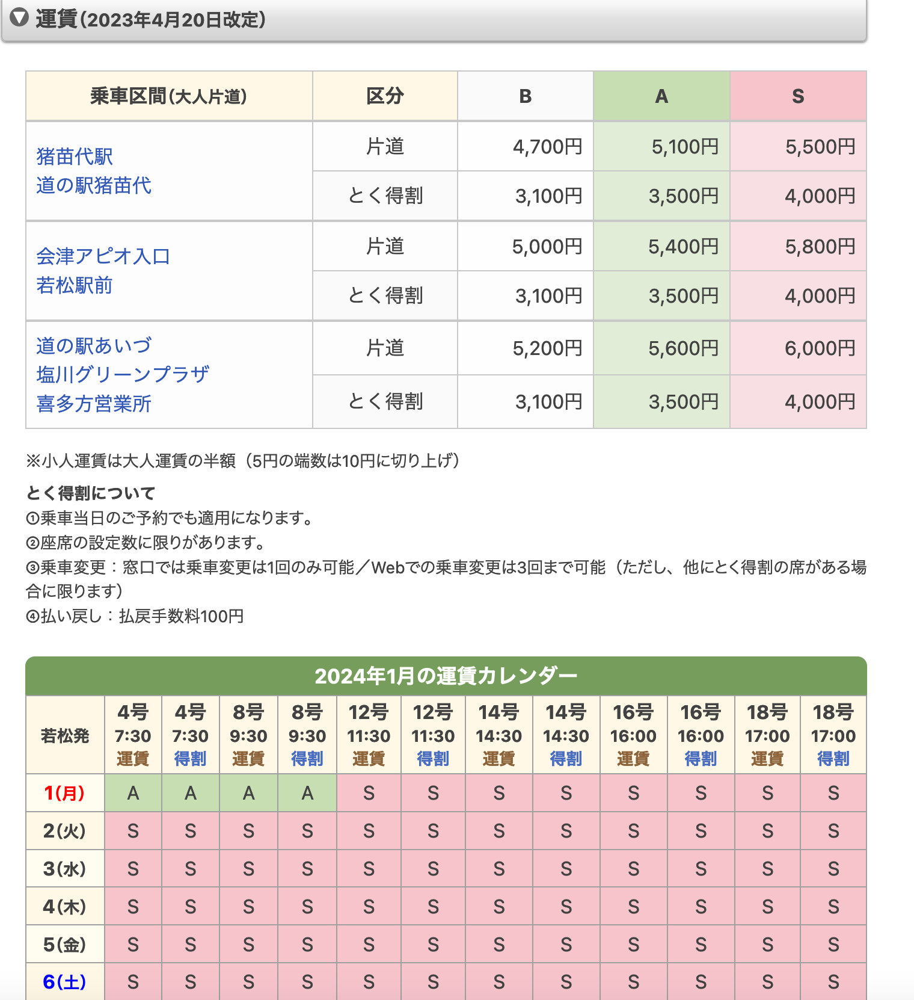
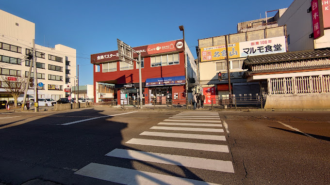
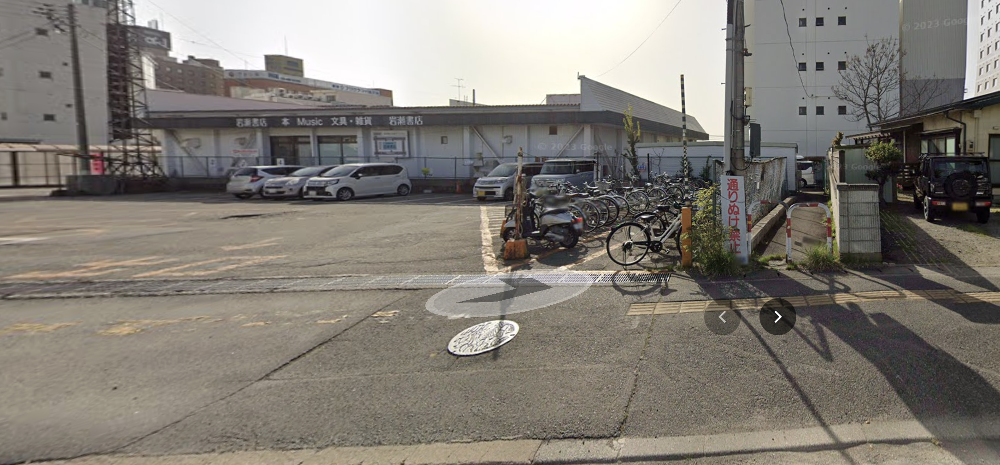

# **Multilingual Warning**
This version is translated from Simplified Chinese, so there may be translation errors, localization issues, and other problems. Native speakers are welcome to make corrections.

# Aizu Guide 
## Transportation
### Tokyo High Speed Bus
#### Fares
Buses are the cheapest way to get to Tokyo, but they take about 4-5 hours.
Currently (2024-01-10), Aizu-Tokyo bus fares are based on a floating calendar price.

Regular Bus tickets are categorized into S, A, and B. Generally speaking, consecutive holidays with holidays are S, regular weekends are A, and weekdays are B.
Early Bird Bus tickets are also categorized into S, A, and B, but they are less expensive, with discounts reaching about 60%.
Tips about Early Bird Tickets:

1. The number of Early Bird Tickets is limited and tickets are usually opened one month in advance. Please check the ticketing website around one month in advance to check if they are available for purchase. The refresh time for purchasing tickets is 10:00 every day.
For example, if you wish to purchase tickets for February 10th, you should check the ticketing website at 10:00 on January 09th to check if they are available.
Purchase Times for Special Dates (Updated on 2024-01-10)

| Date of Travel | Start of Sale |
| --- | --- |
| January 1st | December 1st |
| February 1st | December 31st |
| March 1st | January 28th (Leap Year: January 29th) |
| March 30th | March 1st (Leap Year: February 29th) |
| March 31st | March 1st |
| April 1st - April 2nd | March 1st |
| May 1st | March 30th |
| June 1st | May 1st |
| July 1st | May 30th |
| August 1st | July 1st |
| September 1st | July 31st |
| October 1st | August 30th |
| November 1st | October 1st |
| December 1st | October 30th |

2. Early bird tickets are more plentiful on weekdays, but on weekends there are a limited number of early bird tickets, which usually sell out within a day (or even within a few hours). For holidays, early bird tickets are usually sold out within minutes.

3. Extra frequencies may be added during special time periods (e.g. end and beginning of the year, Chinese New Year, Golden Week, Summer Recess, Silver Week Recess, etc.).

Exact ticket prices will be announced on the official website, so check it out.
You can also click on the link below to see the latest ticket prices:
https://www.aizubus.com/highway/shinjuku/

#### Ticketing
Ticketing website in Japanese: https://www.kousokubus.net/BusRsv/ja/
English-Korean-Simplified Chinese-Traditional Chinese ticketing website: https://www.kousokubus.net/JpnBus/en
The ticketing website has detailed procedures for purchasing tickets, so I won't repeat them here.
The Tokyo Line is the only one of Aizu's common highway bus routes that requires advance ticketing, and is operated on a "reservation system". If you forget to buy a ticket or buy a ticket on the wrong day, you can talk to the conductor, and there are usually seats available on the bus, so you can buy a ticket and get on the bus.
Tickets can also be purchased at the Aizu Bus Terminal and Shinjuku Bus Terminal ticket counters.

#### Aizu → Tokyo/Shinjuku
##### Stations
In Aizuwakamatsu City, there are two boarding points: Aizuwakamatsu Ekimae Bus Terminal and Aizuwakamatsu Apio.
Please note that unlike other highway bus routes, the "Kitayanagahara" and "Tsuruga Castle/Engineering Office Building" stops are not included in the boarding and alighting area of the Tokyo Line.
* Aizu Station Bus Terminal
Please note that the Aizu Ekimae Bus Terminal is not the same place as the Aizu-Wakamatsu Ekimae (Aizu-Wakamatsu JR Station) where you get off.
Below is a screenshot and a link to Google Map:
https://goo.gl/maps/qgiU622bZdTWoRsj8

Bicycles can be parked here:
https://www.google.com/maps/@37.5077452,139.9316315,19z?entry=ttu

Private bicycles can be parked at the "2nd Shiraho-cho Happi Parking Lot"(第２白虎町ハッピーパーキング):
Maximum 500 yen per day.
http://www.tengudo.com/happyb/
* Aizuwakamatsu Apio
This is the pickup point for the Apio:
https://www.google.com/maps/@37.5203862,139.9182684,95m/data=!3m1!1e3?entry=ttu
Apio is suitable for residents who own private cars in addition to those who live in its neighborhood.Apio has a free parking lot with two parking lots. However, please note that you must purchase two round-trip Bus tickets to use this parking lot or you will be fined if you are caught. The parking lot is on a reservation system and you need to call to make a reservation. Usually, you will be asked to tell them your [name, phone number, bus time, and personal car license plate number].
Here is the phone number:

| Phone Hours | Phone Numbers |
| -------- | -------- |
| Monday through Friday | 0242-22-5560 (9:00～18:00 except year-end and new year holidays) |
| Saturdays, Sundays and Holidays | 0242-22-5583 (9:00～16:00) |

Here is the location of the parking lot:
First parking lot
https://maps.app.goo.gl/usUTr7pVHbNasmQD8
Second parking lot
https://maps.app.goo.gl/Gm9t8Pxddiv7ZrKZ9

##### Ride the bus
* :: Waiting for the Bus
Please arrive at the Bus stop early and wait for the Bus to arrive. However, you usually don't have to worry about the bus leaving early (but it may step off, so please be sure to arrive early). Due to traffic, the bus to Aizuwakamatsu Apio is 5-10 minutes late in most cases during rush hour. However, buses to the bus terminal in front of Aizuwakamatsu Station are usually not late. Please be patient.

* Luggage
Suitcases and large luggage can be placed in the storage area under the special vehicle. The driver will help you to open the door of the storage area before boarding the bus, and sometimes you need to place them by yourself, sometimes the driver will help you.
Usually 2 large suitcases can be put down during busy non-holiday periods.
Normal backpacks and carry-on bags can be brought on board.

* Getting on the bus
When you finish purchasing your ticket, you will receive an email that you need to have the driver/machine scan the QR code, so please prepare it in advance. A PDF file for printing or a web page is fine. In some cases, you may only need to show the PDF file or web page.
When you get on the bus, please sit down according to the seat number you chose when you purchased the ticket. Fasten your seat belt.

* While traveling
Please be aware that you need to be quiet while traveling on buses in Japan, so please do not disturb other people.
Most buses provide free WiFi and charging ports. (However, because of the different models, some things require plugs and some are USB ports)

* SA/PA Service Area
There are two SA/PA stops on the Tokyo line, [Abukuma PA] and [Hasei SA].
However, the typical stop is only 8-15 minutes (depending on traffic), and it's usually time to use the restroom and purchase food. It is almost unlikely that you will be able to eat in the service area.
Please don't miss the Bus.
PS: Abukuma PA is currently (07/28/2023) closed for all stores, only toilets and vending machines.

* Getting off the train
There are three drop-off points on the Tokyo Line: [Oji Station], [Ikebukuro Station] and [Shinjuku].
The fare is the same no matter where you get off, so please don't worry.
When you get close to the drop-off point, the car will announce a voice, when the voice is almost finished, press the button to tell the driver that someone wants to get off, then the driver will stop the car. Because the Tokyo line is quite busy, the button is pressed in most cases. The button only needs to be pressed by someone, so there is no need to press it repeatedly. Please don't press the button too early either, it will make the driver think there is an emergency.
When the bus stops, then unbuckle your seatbelt, take your luggage, and get off the bus. The aisles are narrow, so please be courteous.
If you are carrying a paper ticket, then please give it to the driver before getting off the bus.
**Oji Station**
This is a stop in northern Tokyo. If you are planning to go to [Akabane], [Saitama], etc., you can choose to get off here.
If you wish to get to Shinjuku or other places quickly, you can get off at Oji Station and take the JR line to get there, as the BUS takes the surface road and will travel slower and longer due to traffic lights and traffic jams. Passengers with severe motion sickness should consider getting off at Oji Station and then taking another form of transportation to your destination.
Also, if you are traveling to Haneda Airport, it is faster to get off at Oji Station and take a train to Haneda Airport.
Please refer to the article [Getting to Haneda Airport].
**Ikebukuro Station***
Please note that Ikebukuro Station only has a drop-off point, not a boarding point.
**Shinjuku Station
Shinjuku Station is a large transportation hub in Tokyo where you can take JR, subway, and buses. Passengers who are traveling to Tokyo for the first time or are unfamiliar with the city may choose to get off here. There is also a passenger service center here where you can inquire about routes, purchase subway cards, etc.
**Tokyo Station**
This route is suspended.

#### Tokyo/Shinjuku → Aizu
##### Stations
There are two boarding points for buses in Tokyo: Shinjuku Bus Terminal and Oji Station.
Please note that there is no boarding point at Ikebukuro Station on the Tokyo/Aizu route.
* Shinjuku Bus Terminal
Among the waiting areas for BusTerminal, the boarding area for Aizu is Area A, but it may change. Please check and confirm the BusTerminal waiting area before boarding.

* Prince Station
The bus stop at Oji Station is not located in the bus area adjacent to the JR station, but is about a 3-minute walk away.
https://goo.gl/maps/4szJ7wUKEggccbR27
Please note that there are many routes to this highway bus ride point, so please do not get on the wrong bus.
Also, because of the traffic congestion in Tokyo, there is usually a 15-minute delay in arrival time at Oji Station. If it's rush hour, it can even reach 30 minutes. There are also a few cases where the Bus will arrive earlier.
However, you still need to arrive early to take the bus, but you don't need to be anxious because the Bus is late.

##### Ride the bus
* Waiting for the bus
Please arrive at the Bus stop early and wait for the Bus to arrive. However, you don't usually have to worry about the Bus leaving early (but it may step off, so please be sure to arrive early).

* Luggage
Suitcases and large luggage can be placed in a special storage area. Before boarding the bus, a driver will help you open the door of the storage area, sometimes you need to arrange them yourself, sometimes the driver will help.
Usually 2 large suitcases can be put down during busy periods on non-holiday days. If you are worried, you can take the train at the departure station - Shinjuku Station.
Normal backpacks and carry-on bags can be brought on board.

* Getting on the train
When you finish purchasing your ticket, you will receive an email and need to have the driver/machine scan the QR code, so please prepare it in advance. A PDF file for printing or a web page is acceptable. In some cases, you may only need to show the PDF file or web page.
When you get on the bus, please sit down according to the seat number you chose when you purchased the ticket. Fasten your seat belt.

* While traveling
Please be aware that you need to be quiet while traveling on buses in Japan, so please do not disturb other people.
Most buses provide free WiFi and charging ports. (However, because of the different models, some things require plugs and some are USB ports)

* SA/PA Service Area
There are two SA/PA stops on the Tokyo line, [Hashio SA] and [Abukuma PA].
However, the typical stop is only 8-15 minutes (depending on traffic), and it's usually time to use the restroom and purchase food. It is almost unlikely that you will be able to eat in the service area.
Please don't miss the Bus.
PS: Abukuma PA is currently (07/28/2023) closed for all stores, only toilets and vending machines.

* Get off the train
There are two drop-off points in Aizuwakamatsu City for the Tokyo Line (bound for Aizu): [Aizu Apio] and [Aizuwakamatsu JR Station Front].
The fare is the same no matter where you get off, so please don't worry. (Only in Aizuwakamatsu City)
When you get close to the drop-off point, the bus will announce a voice, and when the voice is almost finished, you can press the button to tell the driver that someone wants to get off, and then the driver will stop the bus. Since both drop-off points are popular, the button is pushed in most cases. The buttons only need to be pressed by someone, no need to press them repeatedly. Please don't push the button too early either, it will make the driver think there is an emergency.
When the Bus stops, then unbuckle your seatbelt, grab your luggage and get off. The aisles are narrow, so please be courteous.
If you are carrying a paper ticket, then please give it to the driver before getting off the bus.
**Aizu Apio**
The drop-off point is here:
https://maps.app.goo.gl/iNHew2xSwEKUAMKr5
If you are going across the road, please do not cross the road directly; cars on that road are going very fast and it is very dangerous. Please walk backwards or forwards to the traffic light and wait for the green light before crossing the road.
**Aizuwakamatsu Mae (in front of the Aizu JR train station)**
The drop-off point is here:
https://maps.app.goo.gl/FmFxugwpoT4vkzTSA
Please note that the drop-off point is not the same as the Aizuwakamatsu BusTerminal.
You can transfer to trains, buses, cabs, etc. here.

**Taxi/Bus discount**
There are discounts for cabs and buses in front of Aizuwakamatsu Station (in front of the JR train station), but the author is not very clear about this. Please inquire by yourself.
Discounts:
https://www.aizubus.com/highway/shinjuku/shinjuku_line_transfer
